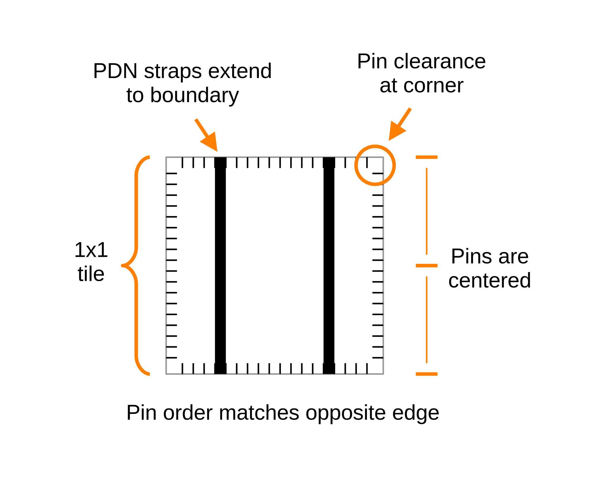
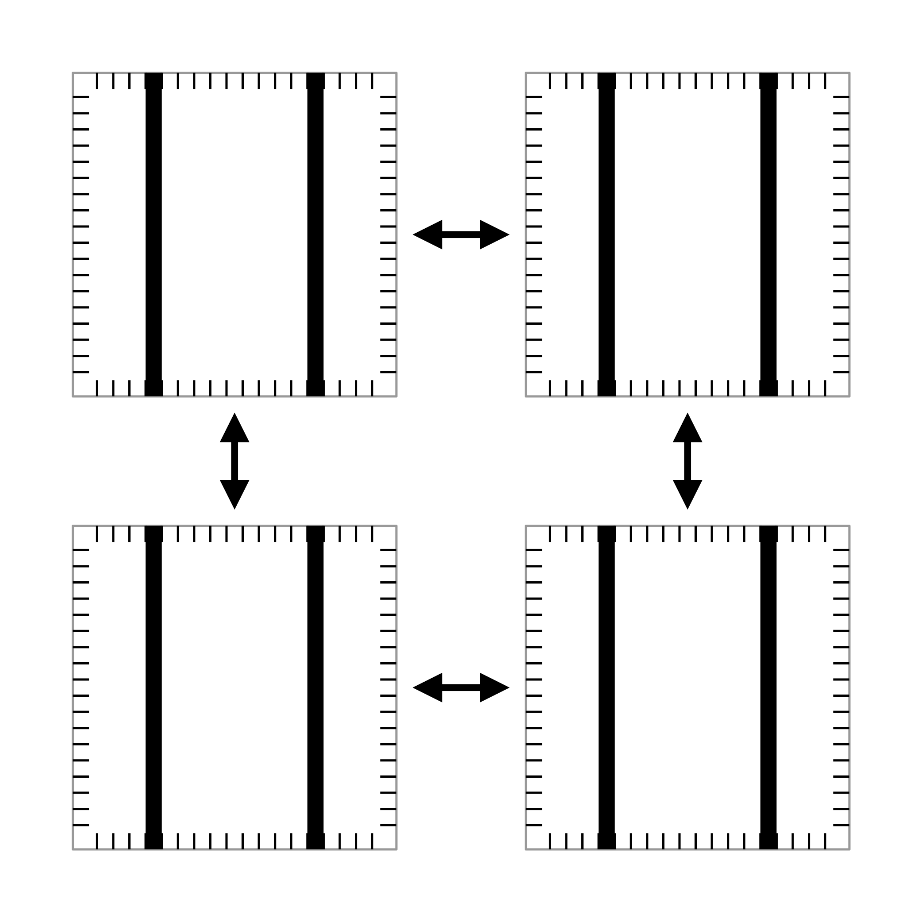
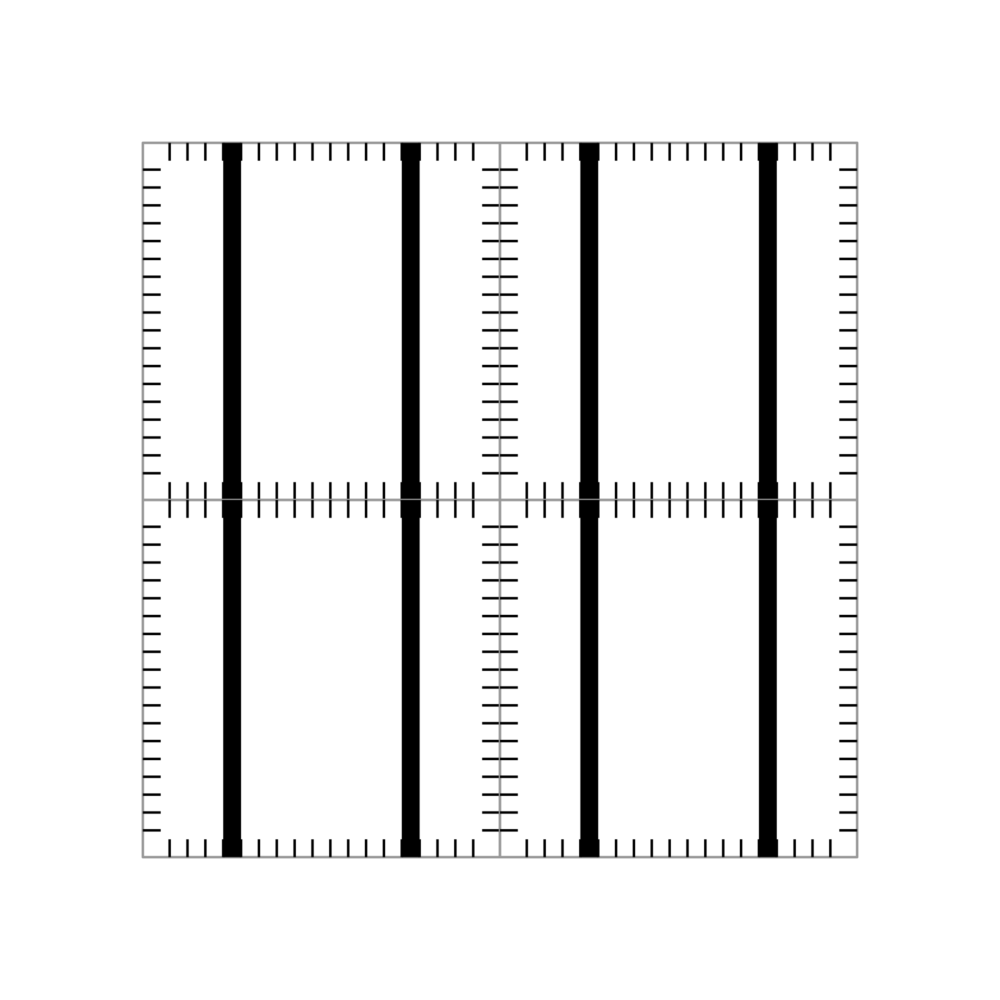
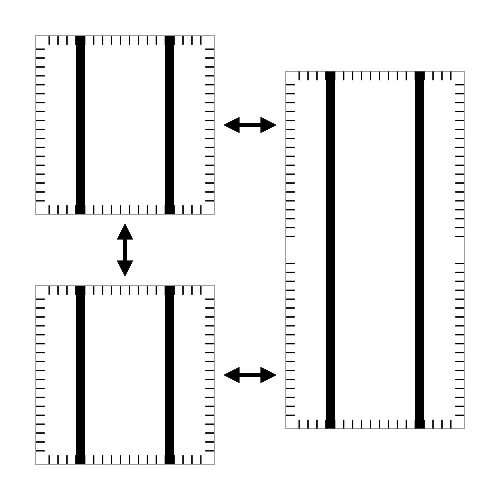
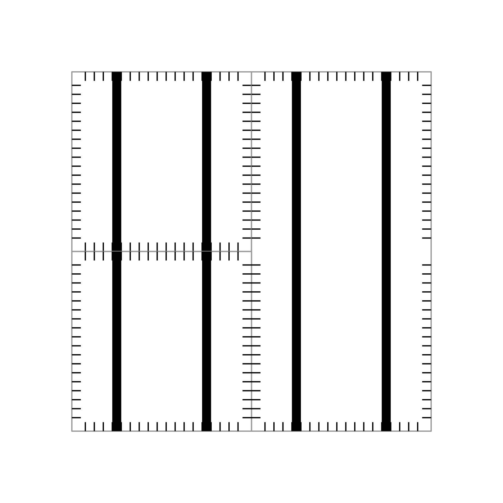

# Tile Stitching

In order to be able to stitch the tiles by abutment, a few things need to be considered:

1. The pin order needs to match the opposide edge
2. The PDN straps need to fully extend to the boundary
3. There should be a pin clearance at the corner or otherwise it might become hard to route

## Stitching 1x1 Tiles

Stitching a fabric with simple 1x1 tiles is as simple as placing the tiles next to each other:

|   |   |
|---|---|
|   |   |

## Stitching Supertiles

Stitching a fabric with supertiles works similarily:

|   |   |
|---|---|
|   |   |

The plugin will consider each edge separately, i.e. the pins that belong to sub-tile of a supertile are placed centered in relation to that edge segment. This is necessary so that supertiles can abut normal 1x1 tiles and the pins are still aligned.

# PDN "hack"

We don't want to place the vertical PDN straps across the tiles during stitching just yet, but rather we want to have the freedom to place them during the top-level integration.

The problem: The vertical PDN straps are pins of the individual macros and not of the top-level. Therefore, the plugin utilizes a custom odb script that simply places top-level pins on top of the already existing vertical PDN straps. Therefore, the straps are recognized as top-level pins.

> [!IMPORTANT]
> Note that the individual straps of the same net must be connected at the top-level, or else you will have tiles without a power connection!
